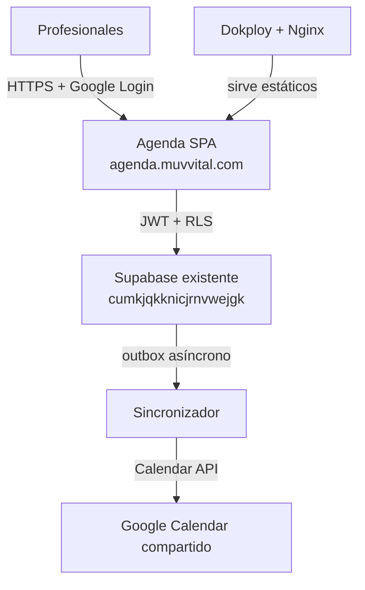
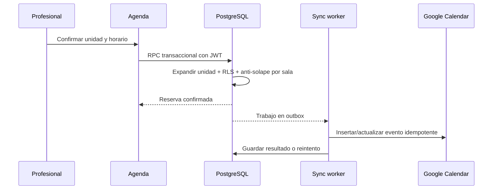
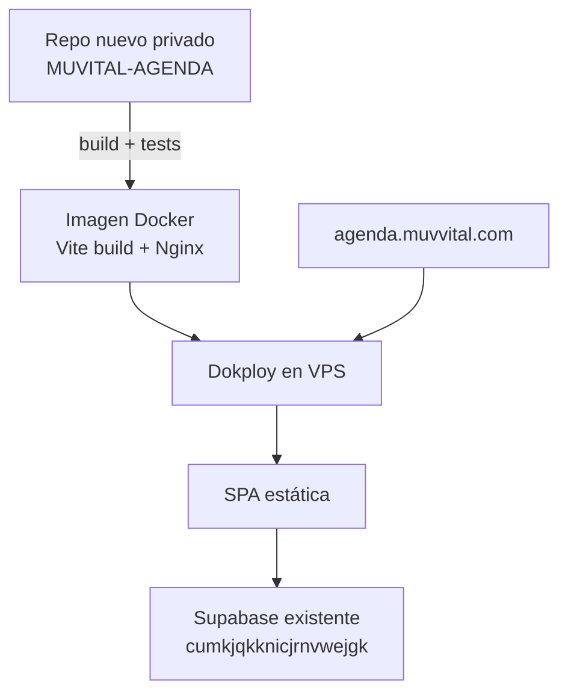

# MÜV Vital - Arquitectura de agenda y reserva de salas

## 1. Control del documento

| Campo | Valor |
|---|---|
| Sistema | Agenda interna de salas MÜV Vital |
| URL prevista | `https://agenda.muvvital.com` |
| Fecha | 2026-08-07 |
| Nivel | Arquitectura objetivo + implementación V1 en revisión |
| Repositorio de referencia | `semaes111/MUVITAL-WEB`, solo lectura |
| Revisión verificada | `main` en `70b2d64cfbdb0b64b9e75e2003a7f38401d04df1` |
| Restricción principal | No modificar, ramificar, desplegar ni añadir archivos a `MUVITAL-WEB` |
| Restricción Supabase | Prohibido crear proyectos nuevos; solo podría reutilizarse un proyecto existente que el propietario designe y autorice expresamente |
| Proyecto Supabase designado | `cumkjqkknicjrnvwejgk` (`https://cumkjqkknicjrnvwejgk.supabase.co`), pendiente de auditoría y autorización técnica |
| Repositorio de implementación | `semaes111/MUVVITAL-AGENDA-`, rama de trabajo independiente |
| Estado de validación | Frontend, migración y sincronizador preparados; migración y secretos todavía no aplicados |

### Convención de evidencia

- **HECHO:** comprobado en el plano, los adjuntos o el repositorio.
- **INFERENCIA:** conclusión probable, todavía no validada con el uso real.
- **PROPUESTA:** decisión recomendada para el nuevo sistema.
- **POR DECIDIR:** elección del propietario que cambia el comportamiento.

## 2. Veredicto ejecutivo

La solución debe ser una aplicación independiente, en un repositorio nuevo y preferiblemente privado, con esta composición:

- frontend React + TypeScript + Vite + Tailwind, coherente con la web actual;
- SPA estática servida por Nginx en un contenedor gestionado por Dokploy;
- el proyecto Supabase existente `cumkjqkknicjrnvwejgk`, ya identificado por el propietario y pendiente de auditoría/autorización antes de cualquier cambio, para Google Login, PostgreSQL, RLS y Realtime;
- PostgreSQL como única fuente de verdad de disponibilidad y exclusión de salas;
- dos unidades reservables: la suite indivisible **Consulta + Exploración** y la sala **Podología**;
- Google Calendar compartido como espejo de solo lectura para los profesionales;
- una función de integración asíncrona para sincronizar reservas con un calendario compartido;
- n8n fuera del camino crítico; puede sustituir a esa función si se prefiere administración visual.

No se recomienda una sincronización bidireccional inicial. Permitir editar reservas desde Google Calendar saltaría las reglas de exclusividad de las salas y crearía dos fuentes de verdad.

Esta arquitectura **no autoriza a crear ningún proyecto Supabase ni a modificar todavía el proyecto identificado**. El endpoint aportado permite fijar el destino lógico, pero no acredita por sí solo su compatibilidad, sus credenciales ni permiso para aplicar migraciones. Antes de utilizarlo habrá que inventariar su esquema, Auth, extensiones, políticas y consumidores actuales mediante una revisión de solo lectura expresamente autorizada. Si no resulta adecuado, la alternativa deberá rediseñarse sobre PostgreSQL/Auth en el VPS, sin crear Supabase por defecto.



## 3. Base de evidencia

### 3.1 Plano

**HECHO.** El plano `03-DISTRIBUCION Y QUIPAMIENTO.pdf` representa los siguientes espacios relevantes. La decisión operativa aportada distingue espacio físico de unidad reservable:

| Espacio físico | Superficie | Unidad de reserva | Estado en la agenda | Tratamiento visual propuesto |
|---|---:|---|---|---|
| Consulta | 8,70 m² | `SUITE_CONSULTA_EXPLORACION` | Se bloquea siempre junto con Exploración | Deep Blue `#244C5D` + icono de vínculo |
| Exploración | 9,12 m² | `SUITE_CONSULTA_EXPLORACION` | Se bloquea siempre junto con Consulta | Igual que Consulta + icono de vínculo |
| Podología | 8,70 m² | `PODOLOGIA` | Reservable de forma independiente | Ocean Recovery `#6BB0B1` |
| Entrenamiento personal | 11,29 m² | Ninguna | Visible en el plano, pero no reservable | Soft Bone/Liquid Silver, etiqueta “No reservable” |

Recepción, circulación, distribución, aseos, zona general de entrenamiento y vestuarios también se representan como contexto, no como recursos reservables.

**DECISIÓN CERRADA.** La aplicación gestiona dos unidades de reserva, aunque el plano muestre tres salas clínicas: (1) Consulta + Exploración como suite indivisible y (2) Podología. Nunca se podrá reservar Consulta o Exploración por separado. Entrenamiento personal no participa en disponibilidad, series ni conflictos.

La agenda utiliza dos acentos funcionales y evita reasignar Golden Balance y Active Pulse, reservados por el manual a HYBRID y TEAMS. El color nunca será la única señal: nombre, icono, patrón y estado acompañarán siempre al acento.

### 3.2 Manual de identidad 2026

**HECHO.** Se ha inspeccionado visualmente y extraído por completo `MUV VITAL_2026_MANUAL.pdf`, de 46 páginas. El manual, desarrollado por Cultiva Marketing, pasa a ser la fuente principal de identidad visual para la agenda.

#### Paleta digital oficial

| Token | Pantone | RGB | HEX | Uso en la agenda |
|---|---|---:|---|---|
| Deep Blue | 7477 | 36, 76, 93 | `#244C5D` | Base oscura, cabecera y acento de la suite |
| Soft Bone | Warm Gray 1 | 216, 212, 215 | `#D8D4D7` | Base clara y superficies |
| Vital Teal | 2237 | 8, 135, 147 | `#088793` | Acción primaria y foco interactivo |
| Ocean Recovery | 2460 | 107, 176, 177 | `#6BB0B1` | Estado clínico/recuperación |
| Golden Balance | 7753 | 193, 160, 39 | `#C1A027` | Método HYBRID; color de sala solo si se aprueba |
| Active Pulse | 158 | 232, 121, 40 | `#E87928` | Método TEAMS; color de sala solo si se aprueba |
| Liquid Silver | 7543 | 151, 165, 185 | `#97A5B9` | Estado neutro/secundario y método RUNNING |

El manual contiene una errata interna en la ficha individual de Active Pulse: repite los valores de Golden Balance. Se adopta `#E87928`, RGB 232/121/40 y Pantone 158 porque son los valores de la tabla general de la página 16 y coinciden con la muestra naranja y las aplicaciones posteriores.

#### Tipografía

| Jerarquía | Familia oficial | Regla del manual |
|---|---|---|
| Título | Playfair Display | 48 px escritorio; 36 px móvil; máximo aproximado de 2 líneas largas o 5 cortas |
| Secundaria | Just Sans | 40-24 px escritorio; 28-22 px móvil |
| Cuerpo | Source Sans 3 | 14-16 px escritorio; 16 px móvil |

La agenda necesita los archivos y la licencia web de Just Sans. Declararla en CSS sin cargarla no cumple el manual: el navegador utilizaría Source Sans 3 como fallback.

#### Logotipo

- **Principal:** pantalla de login y cabecera de escritorio.
- **Sello circular:** icono de aplicación, acceso directo y contextos compactos.
- **Variantes de método:** RUNNING, HYBRID, MEDICAL y TEAMS no se usarán para identificar salas salvo aprobación expresa.
- Mantener el área de seguridad definida por el manual, las proporciones y el contraste.
- No deformar, recolorear aleatoriamente, reordenar ni reconstruir el logotipo con una fuente aproximada.
- Los dos JPEG aportados son referencias visuales de 682 px, no masters de producción. Para una interfaz nítida se requiere el original vectorial SVG/PDF o un PNG de alta resolución con transparencia.

#### Lenguaje visual y tono

- formas rectas y curvas derivadas del propio logotipo;
- patrones discretos, no decoraciones ajenas a la marca;
- iconos esenciales basados en movimiento, precisión y equilibrio;
- tono moderno, cercano e inspirador;
- personalidad integrada, humana, profesional, holística y premium sin resultar distante.

En una herramienta operativa, este tono se traducirá en mensajes breves y humanos: “Sala ocupada por Ana hasta las 18:00” o “Ese intervalo acaba de reservarse”. No se trasladará a la agenda el lenguaje promocional de la landing.

### 3.3 Web actual

**HECHO.** En la revisión analizada, la web usa React 19, TypeScript, Vite 7 y Tailwind 3.4, y se compila como sitio estático. Su implementación de marca está definida en `tailwind.config.ts` y `src/index.css`, pero no coincide exactamente con el manual 2026:

| Manual 2026 | Repo actual | Diferencia |
|---|---|---|
| Deep Blue `#244C5D` | Grafito/Petróleo `#214C53` | Distinto RGB |
| Soft Bone `#D8D4D7` | Mineral `#D9D4C8` | Distinto matiz |
| Vital Teal `#088793` | Vital `#2E888D` | Distinto RGB |
| Ocean Recovery `#6BB0B1` | Clínico `#ABD2CF` | Distinto tono y luminosidad |
| Golden Balance `#C1A027` | Metal `#C3A43C` | Aproximación, no valor oficial |
| Active Pulse `#E87928` | Energía `#E87722` | Aproximación, no valor oficial |
| Liquid Silver `#97A5B9` | Niebla `#9EA9B0` | Distinto matiz |

Los JPEG aportados también reproducen el logotipo en aproximadamente `#214C53`, no en el Deep Blue oficial `#244C5D`. No se deben obtener colores con cuentagotas de esos JPEG.

**PROPUESTA.** Crear en el repo nuevo tokens basados en el manual, sin copiar literalmente la paleta aproximada de `tailwind.config.ts`. Sí se reutilizarán la estructura técnica, las convenciones React/Vite y los activos oficiales que dispongan de master adecuado. No importar el repositorio original como submódulo, paquete o dependencia y no añadir un enlace en su footer mientras siga vigente la regla de no tocarlo.

### 3.4 Documentos técnicos adjuntos

Los adjuntos contienen decisiones valiosas: repositorio separado, rango temporal PostgreSQL, constraint anti-solape, zona horaria `Europe/Madrid`, Realtime y ausencia de datos de pacientes. Sin embargo, requieren estas correcciones:

| Punto de los adjuntos | Corrección necesaria |
|---|---|
| “No se construye backend” | La sincronización con Google y las operaciones privilegiadas sí requieren una función o worker de backend. |
| Vercel en una sección y Hostinger en otra | Se fija una sola topología recomendada: contenedor estático en Dokploy; Hostinger estático queda como alternativa. |
| Feed ICS como vinculación principal | Es de solo lectura y su refresco lo decide Google; no cubre sincronización inmediata. |
| Autorización continua por email en `auth.jwt()` | El email solo debe servir para el alta inicial; después se autoriza por `auth.uid()`. |
| Función `SECURITY DEFINER` en `public` | Las funciones privilegiadas deben estar fuera de esquemas expuestos, con `search_path` cerrado y permisos explícitos. |
| Borrado físico de reservas | Se sustituye por cancelación lógica y auditoría. |
| Límite fijo de 8 horas | No está respaldado por un requisito y podría impedir una jornada completa. Debe ser configurable. |
| Ocho `INSERT` como sistema de garantía | Se necesita serie, propietario, cobertura mañana/tarde y liberación de ocurrencias. |
| “Coste 0 €” y “un día” | No son compromisos verificables de producción. |
| Cambio en `Footer.tsx` | Contradice expresamente la regla actual de no tocar `MUVITAL-WEB`. |
| Catorce pruebas superadas | Los scripts SQL citados no están entre los tres archivos recibidos; el resultado no puede auditarse todavía. |

## 4. Requisitos funcionales consolidados

### 4.1 Profesionales

- acceso mediante cuenta Google;
- lista de miembros autorizados gestionada por un coordinador;
- cuatro profesionales iniciales y altas posteriores sin despliegue;
- todos los miembros activos ven quién ocupa cada sala y hasta qué hora;
- cada profesional crea, modifica o cancela solo sus reservas futuras;
- un coordinador administra salas, miembros, turnos fijos y correcciones;
- los registros pasados no se editan desde la interfaz ordinaria.

### 4.2 Reservas

- el usuario reserva una **unidad de reserva**, no una sala física suelta;
- `SUITE_CONSULTA_EXPLORACION` crea y libera conjuntamente la ocupación de Consulta y Exploración en una única transacción;
- `PODOLOGIA` ocupa únicamente la sala de Podología;
- Entrenamiento personal no se puede seleccionar ni reservar;
- una sala física no puede tener dos ocupaciones confirmadas solapadas;
- se admiten bloques como viernes 15:30-18:00;
- inicio incluido y fin excluido: una reserva que termina a las 18:00 permite otra a las 18:00;
- fechas almacenadas en UTC y mostradas en `Europe/Madrid`;
- cambios visibles en segundos en todas las sesiones abiertas;
- cancelación, no borrado;
- turnos fijos semanales distinguibles de reservas puntuales;
- incorporación de nuevas salas físicas y unidades simples o compuestas por datos, no por cambios de código.

### 4.3 Garantía de mañana y tarde

La garantía no debe modelarse como una prioridad abstracta. Debe materializarse como asignaciones recurrentes confirmadas:

1. el coordinador asigna a cada profesional una serie de mañana y otra de tarde sobre una unidad de reserva;
2. el sistema genera las ocurrencias futuras con un `series_id` común;
3. el constraint anti-solape protege esas ocurrencias;
4. el propietario puede liberar una fecha concreta sin eliminar la serie;
5. el panel de coordinación muestra si cada miembro tiene ambas coberturas o ha renunciado expresamente a una de ellas.

**POR DECIDIR.** Hay que confirmar si los valores provisionales 08:00–14:00 y 14:00–23:00 cuentan como “mañana” y “tarde”, y el horizonte de generación: por curso, por año natural o ventana móvil.

## 5. Arquitectura de aplicación

### 5.1 Frontend

| Elemento | Decisión |
|---|---|
| Framework | React + TypeScript + Vite |
| Estilo | Tailwind con tokens derivados del manual MÜV Vital 2026 |
| Estado remoto | Cliente Supabase solo tras auditar y autorizar el proyecto designado; caché ligera y sin duplicar el calendario completo en estado global |
| Autenticación | Supabase Auth con Google, condicionada a reutilizar el proyecto autorizado |
| Tiempo | `timestamptz` en datos; `Europe/Madrid` en presentación y generación de series |
| Actualización | Supabase Realtime para invalidar y recargar el intervalo visible |
| Accesibilidad | Nombre, icono y patrón además de color; navegación de teclado; contraste AA |

El frontend se divide en cinco módulos:

1. `auth`: sesión, callback y comprobación de membresía;
2. `floorplan`: plano SVG interactivo y estado actual;
3. `schedule`: vistas día/semana, filtros y bloques de reserva;
4. `bookings`: crear, editar, cancelar y liberar ocurrencias;
5. `admin`: miembros, salas, series fijas y estado de sincronización.

### 5.2 Vistas recomendadas

- **Ahora:** dos tarjetas de unidad reservable y un plano. Consulta y Exploración comparten estado, profesional y hora de salida; Entrenamiento aparece como no reservable.
- **Día:** eje horario vertical y dos columnas: Suite Consulta + Exploración y Podología. Es la vista operativa principal.
- **Semana:** una unidad seleccionada y siete columnas de día; evita mezclar espacio físico con disponibilidad lógica.
- **Móvil:** lista cronológica por día con filtro de unidad; no encoger la cuadrícula de escritorio.
- **Coordinación:** cobertura mañana/tarde, series fijas, usuarios activos y errores de Google.

El plano debe redibujarse como SVG simplificado y responsivo a partir del plano técnico. No se debe usar el PDF completo como fondo interactivo.

### 5.3 Uso del color

El color representa la unidad reservable, no al profesional. El profesional aparece mediante nombre, iniciales y avatar. Esta capa funcional debe documentarse separadamente de los colores reservados a los métodos RUNNING, HYBRID, MEDICAL y TEAMS.

No debe usarse texto blanco sobre Ocean Recovery, Golden Balance, Active Pulse o Liquid Silver: el contraste medido es insuficiente para texto normal. Vital Teal tampoco alcanza AA normal con blanco. Se recomienda tarjeta Soft Bone neutra con borde/acento de unidad, texto Deep Blue y un indicador cromático; si se utiliza un relleno completo claro, el texto será casi negro. Los dos acentos funcionales siempre irán acompañados de etiqueta e icono. En el plano, Consulta y Exploración compartirán acento y un vínculo gráfico inequívoco; Entrenamiento utilizará un estado neutro no interactivo.

## 6. Arquitectura de datos propuesta

| Entidad | Responsabilidad |
|---|---|
| `organizations` | Centro y zona horaria; deja preparada una futura segunda sede. |
| `rooms` | Espacios físicos: nombre, tipo, superficie, estado y clave del polígono SVG. |
| `booking_units` | Recursos lógicos que el usuario puede seleccionar: suite y Podología. |
| `booking_unit_rooms` | Relación N:M que compone cada unidad con una o varias salas físicas. |
| `members` | Vínculo estable con `auth.users`, nombre, rol, estado y organización. |
| `member_invitations` | Emails preautorizados pendientes de enlazar con `auth.uid()`. |
| `booking_series` | Definición de turnos fijos por unidad y horizonte de recurrencia. |
| `bookings` | Cabecera de cada reserva puntual o de serie, con profesional e intervalo. |
| `room_occupancies` | Una fila por sala física bloqueada; soporta la exclusión anti-solape. |
| `booking_audit` | Historial inmutable de alta, cambio y cancelación. |
| `calendar_event_links` | Correspondencia reserva-evento Google y estado de sincronización. |
| `integration_outbox` | Trabajo pendiente, reintentos e idempotencia de integraciones. |

### 6.1 Reserva y exclusión

Esquema conceptual recomendado:

```sql
-- PROPUESTA ILUSTRATIVA; no sustituye a la migración completa.
booking_units (
  id uuid primary key,
  organization_id uuid not null,
  code text not null,
  name text not null,
  is_active boolean not null
)

booking_unit_rooms (
  booking_unit_id uuid not null,
  room_id uuid not null,
  primary key (booking_unit_id, room_id)
)

bookings (
  id uuid primary key,
  organization_id uuid not null,
  booking_unit_id uuid not null,
  member_id uuid not null,
  starts_at timestamptz not null,
  ends_at timestamptz not null,
  kind text check (kind in ('ad_hoc', 'standing_allocation')),
  status text check (status in ('confirmed', 'cancelled')),
  series_id uuid null,
  created_by uuid not null,
  cancelled_at timestamptz null,
  created_at timestamptz not null,
  updated_at timestamptz not null
)

room_occupancies (
  booking_id uuid not null,
  organization_id uuid not null,
  room_id uuid not null,
  period tstzrange not null,
  status text check (status in ('confirmed', 'cancelled')),
  primary key (booking_id, room_id)
)
```

Reglas en PostgreSQL:

- `ends_at > starts_at`;
- exclusión GiST en `room_occupancies` por organización, `room_id` y `period` solo para `status='confirmed'`;
- claves foráneas y pertenencia a la misma organización;
- trigger de auditoría;
- RPC/función transaccional que expande la unidad a sus salas, crea o cancela todas las ocupaciones y evita estados parciales;
- escrituras directas del navegador sobre `room_occupancies` revocadas;
- trigger o función controlada que impida alterar el pasado y mantenga cabecera/ocupaciones sincronizadas;
- duración mínima, máxima y horario de apertura configurables, no codificados sin decisión empresarial.

La exclusión en base de datos es obligatoria. Una comprobación previa en el navegador mejora el mensaje, pero no evita dos reservas concurrentes.

### 6.2 Unidad compuesta y atomicidad

**DECISIÓN CERRADA.** Consulta y Exploración se reservan siempre juntas. La operación de alta recibe `booking_unit_id`, obtiene las salas asociadas y crea la cabecera más todas sus ocupaciones dentro de una sola transacción PostgreSQL:

- para `SUITE_CONSULTA_EXPLORACION`, genera exactamente dos ocupaciones con el mismo intervalo;
- para `PODOLOGIA`, genera exactamente una;
- si Consulta **o** Exploración ya está ocupada, la exclusión GiST produce el conflicto y revierte toda la transacción;
- una modificación o cancelación actúa igualmente sobre todas las ocupaciones de la reserva;
- la composición se captura en las ocupaciones de cada reserva, de modo que un cambio futuro en la unidad no reescriba el historial.

Esta regla no se implementa con dos `INSERT` sucesivos desde el navegador: permitiría una reserva parcial ante errores, concurrencia o pérdida de conexión.

## 7. Identidad, autorización y seguridad

### 7.1 Alta y login

1. El coordinador preautoriza un email Google.
2. El usuario inicia sesión con Google mediante Supabase Auth.
3. En el primer acceso, una operación controlada enlaza la invitación con `auth.uid()`.
4. Desde ese momento, RLS autoriza por UUID, no por texto de email.
5. Un usuario autenticado pero no autorizado recibe una pantalla de acceso denegado y no datos vacíos ambiguos.

El login solicita solo identidad básica. No debe solicitar permisos de Calendar a cada profesional si se usa el calendario compartido recomendado.

### 7.2 Roles

| Rol | Lectura | Reservas propias | Series fijas | Miembros/salas | Correcciones |
|---|---|---|---|---|---|
| Profesional | Toda la ocupación interna | Crear, modificar y cancelar futuras | Liberar ocurrencias propias | No | No |
| Coordinador | Toda | Cualquiera | Crear y modificar | Sí | Sí, auditadas |
| Administrador técnico | Diagnóstico | Solo soporte | Soporte | Configuración | Acceso excepcional auditado |

Los roles se guardan en tablas controladas o `app_metadata`, nunca en `user_metadata` editable por el usuario.

### 7.3 RLS y Data API

- RLS activada en todas las tablas expuestas.
- Las políticas combinan `TO authenticated` con pertenencia a organización y propiedad; `TO authenticated` por sí solo no autoriza filas.
- Las actualizaciones usan `USING` y `WITH CHECK`.
- La clave de servicio nunca aparece en el frontend.
- Las funciones `SECURITY DEFINER`, si son imprescindibles, viven en un esquema no expuesto, usan nombres totalmente cualificados, `search_path` cerrado y grants mínimos.
- En proyectos Supabase creados en 2026 hay que configurar explícitamente la exposición/grants de Data API; crear una tabla en `public` ya no debe suponerse suficiente.

### 7.4 Minimización de datos

La agenda almacena recursos y profesionales, no pacientes. No habrá nombre, teléfono, diagnóstico, tratamiento ni iniciales de pacientes en títulos o notas. Los motivos, si existen, serán categorías cerradas como `consulta`, `exploración`, `podología` o `bloque interno`.

## 8. Google Calendar

### 8.1 Modelo recomendado

Supabase manda; Google refleja.

- una cuenta controlada por MÜV Vital crea el calendario secundario `MÜV Vital - Salas`;
- los profesionales reciben permiso de lectura;
- la identidad técnica de integración recibe permiso de escritura;
- cada reserva confirmada genera o actualiza un evento;
- cada cancelación cancela o elimina el evento espejo;
- el evento contiene unidad reservable, profesional y horario, nunca datos de pacientes;
- el título sigue un formato estable, por ejemplo `Suite Consulta + Exploración — Ana` o `Podología — Luis`;
- los usuarios editan en `agenda.muvvital.com`, no en Google Calendar.

**DECISIÓN CERRADA.** La vinculación de la primera versión es este único calendario compartido. No se leen ni escriben las agendas personales de los profesionales.

Google permite compartir un calendario completo con roles de lectura o escritura. La API también permite fijar un identificador de evento propio para reducir duplicados. Se usará un ID determinista o una tabla de correspondencia con idempotencia.

### 8.2 Por qué no usar ICS como integración principal

Un feed ICS es válido como contingencia de solo lectura, pero Google decide cuándo lo refresca. No garantiza que una reserva recién creada aparezca de inmediato. Por tanto, no cumple por sí solo la interpretación fuerte de “vinculado al calendario real actual”.

### 8.3 Agendas personales fuera de alcance

Escribir en el calendario principal de cada profesional exige consentimiento Calendar, acceso offline y almacenamiento seguro de refresh tokens. Además, una cuenta de servicio no puede poblar asistentes sin delegación de dominio, algo no disponible para un conjunto de cuentas Gmail personales.

Leer `freeBusy` privado queda expresamente fuera de la primera versión. Si más adelante se solicita, será una ampliación separada con consentimiento individual y alcance mínimo; no se mezclará con el login básico ni cambiará que PostgreSQL sea la autoridad de las salas.

### 8.4 Flujo asíncrono



El éxito de la reserva no depende de que Google responda. Si Google falla, la reserva sigue siendo válida y el panel muestra “pendiente de sincronizar”.

### 8.5 Edge Function frente a n8n

| Opción | Ventaja | Coste/riesgo | Veredicto |
|---|---|---|---|
| Supabase Edge Function | Menos infraestructura, secretos junto al backend y versionado con el proyecto | Código TypeScript y observación de reintentos | Recomendada |
| Worker en VPS | Control total y reutiliza Dokploy | Otro servicio, healthcheck y despliegue | Válida si se quiere concentrar integraciones en VPS |
| n8n | Flujo visual y edición sin compilar | Más credenciales, estado y dependencia operacional | Opcional; nunca autoridad sobre disponibilidad |
| ICS | Muy simple | Lectura y refresco no inmediato | Solo contingencia |

## 9. Realtime y consistencia

- El frontend consulta únicamente el rango visible de fechas.
- Realtime no reemplaza la consulta inicial ni la constraint de base de datos.
- Un cambio recibido invalida el rango afectado y provoca una recarga breve.
- La tabla debe añadirse/configurarse en la publicación Realtime correspondiente.
- Las cancelaciones lógicas evitan depender de payloads `DELETE`, cuya filtración RLS tiene limitaciones específicas.
- Tras una reconexión, siempre se recarga el rango visible; no se supone que se recibieron todos los eventos mientras el navegador estuvo offline.

## 10. Despliegue

### 10.1 Topología recomendada



El repo `MUVITAL-WEB` no participa en este pipeline.

### 10.2 Contenedor

- etapa de build Node con dependencias fijadas y lockfile;
- etapa final Nginx sin Node ni credenciales de compilación;
- cabeceras CSP, HSTS, `X-Content-Type-Options` y política de caché para assets con hash;
- healthcheck HTTP;
- configuración SPA para devolver `index.html` en rutas internas;
- despliegues inmutables y rollback a la imagen anterior.

### 10.3 Variables

Frontend, públicas por diseño:

- `VITE_SUPABASE_URL`;
- `VITE_SUPABASE_PUBLISHABLE_KEY`.

Backend/Edge Function, secretas:

- credencial de la integración Google;
- ID del calendario compartido;
- secreto de firma de webhooks si se utiliza n8n o un worker VPS.

Nunca se expone `service_role` ni una clave privada de Google en variables `VITE_*`.

### 10.4 Alternativa Hostinger estático

También es viable subir `dist/` a un document root separado del subdominio. Es más simple, pero ofrece peor automatización, observabilidad y rollback que el Dokploy ya disponible. No debe alojarse dentro de `public_html` de la web principal.

## 11. Pruebas y criterios de aceptación

### 11.1 Base de datos

- reservar la suite crea exactamente dos ocupaciones: Consulta y Exploración;
- un conflicto en cualquiera de las dos salas rechaza toda la suite y no deja ninguna ocupación parcial;
- dos reservas concurrentes sobre la suite: exactamente una vence;
- Podología puede reservarse en el mismo horario que la suite;
- Entrenamiento personal no admite reservas ni series;
- reservas contiguas: se aceptan;
- usuario no autorizado: cero lecturas y cero escrituras;
- profesional: no modifica reservas ajenas;
- coordinador: corrección auditada;
- cancelación de la suite libera Consulta y Exploración de forma atómica sin borrar el historial;
- cambio horario de marzo y octubre en `Europe/Madrid`;
- liberación de una ocurrencia no cancela la serie completa;
- cambios de una serie solo afectan al futuro;
- RLS probada con claves de usuario reales, no como `postgres` o `service_role`.

### 11.2 Frontend y E2E

- login, callback y acceso denegado;
- crear el ejemplo viernes 15:30-18:00;
- comprobar que la interfaz ofrece dos unidades y muestra Entrenamiento como no reservable;
- comprobar que Consulta y Exploración siempre reflejan el mismo estado de ocupación;
- conflicto `23P01` traducido a un mensaje comprensible;
- actualización en otra sesión abierta;
- plano, día, semana y móvil;
- navegación con teclado y contraste;
- zona horaria correcta en navegador configurado fuera de España;
- alta de quinto profesional y de una nueva unidad/sala sin cambio de frontend.

### 11.3 Google Calendar

- creación, modificación y cancelación;
- retry tras fallo temporal;
- reejecución sin evento duplicado;
- error persistente visible al coordinador;
- conciliación nocturna entre reservas confirmadas y eventos espejo;
- ningún dato de paciente en payloads o logs.

## 12. Observabilidad y operación

- logs de autenticación y base de datos en Supabase;
- estado de `integration_outbox` y `calendar_event_links` en el panel coordinador;
- alerta si un trabajo supera el número máximo de reintentos;
- auditoría de cambios de reservas y series;
- copias de seguridad y prueba periódica de restauración;
- métrica mínima: reservas creadas, conflictos evitados, cancelaciones y retraso de sincronización;
- runbook para Google desconectado: la agenda sigue operativa y se reconcilia después.

## 13. Fases recomendadas

| Fase | Alcance | Salida verificable |
|---|---|---|
| 0. Preparación | Fijar reglas horarias/recurrencia y auditar de forma autorizada el proyecto Supabase identificado | Precondiciones técnicas cerradas |
| 1. Núcleo | Repo nuevo, Auth, miembros, salas, reservas, RLS y anti-solape | Reserva segura sin Google |
| 2. UX | Plano SVG, día, semana, móvil y Realtime | Uso interno completo |
| 3. Garantías | Series fijas, cobertura mañana/tarde y liberación | Reparto operativo |
| 4. Google | Calendario compartido, outbox, worker y conciliación | Espejo fiable |
| 5. Producción | Docker, Dokploy, DNS, TLS, pruebas E2E y runbook | Despliegue estable |

Como estimación no contractual, un MVP serio ocupa aproximadamente 5-8 jornadas de desarrollo y verificación. Una demo visual puede hacerse antes, pero no debe confundirse con una agenda segura en producción.

## 14. Decisiones cerradas y parámetros pendientes

| Decisión | Resolución |
|---|---|
| Entrenamiento personal | No es un recurso reservable; solo aparece como contexto en el plano. |
| Consulta y Exploración | Se reservan siempre de forma conjunta y atómica. |
| Google Calendar | Un calendario compartido, unidireccional y de solo lectura para profesionales. |
| Backend Supabase | Proyecto existente identificado: `cumkjqkknicjrnvwejgk`; no se crea otro. |
| Horario operativo | 08:00–23:00, `Europe/Madrid`. |

Antes de activar producción deben cerrarse estos parámetros operativos y técnicos:

1. qué horas computan como mañana y como tarde;
2. horizonte de generación de series: curso, año natural o ventana móvil;
3. confirmar o cambiar los valores iniciales de granularidad (15 minutos) y duración mínima (30 minutos);
4. auditoría de solo lectura del proyecto identificado y autorización separada para cualquier migración, configuración de Auth o secreto.

La URL aportada identifica el proyecto, pero no equivale a credenciales ni a permiso para modificarlo.

## 15. Qué hacer y qué no hacer

### Hacer

- utilizar exclusivamente el repo nuevo `MUVVITAL-AGENDA-` y decidir antes de producción si debe pasar de público a privado;
- auditar y reutilizar únicamente el proyecto Supabase existente `cumkjqkknicjrnvwejgk` cuando se autorice expresamente;
- mantener la base de datos autorizada como autoridad única de disponibilidad;
- probar RLS y concurrencia con roles reales;
- probar como invariantes la ocupación conjunta de Consulta + Exploración y el rollback completo ante conflicto;
- añadir cancelación y auditoría desde el principio;
- realizar un spike pequeño de Google antes de cerrar la credencial técnica;
- conservar el repo y el despliegue de la web comercial intactos.

### No hacer

- no añadir el calendario, el enlace o dependencias al repo `MUVITAL-WEB`;
- no crear ningún proyecto nuevo en Supabase;
- no aplicar migraciones, configurar Auth, exponer tablas ni obtener claves de un proyecto existente sin autorización específica;
- no usar Google Calendar como autoridad de disponibilidad;
- no solicitar scopes Calendar durante el login básico;
- no guardar datos de pacientes;
- no confiar en la clave pública, el frontend o una comprobación previa para impedir solapes;
- no colocar `service_role`, refresh tokens o claves de Google en el bundle;
- no introducir n8n en la operación de reservar una sala.

## 16. Referencias verificadas

- [Repositorio MUVITAL-WEB](https://github.com/semaes111/MUVITAL-WEB)
- [Revisión analizada](https://github.com/semaes111/MUVITAL-WEB/commit/70b2d64cfbdb0b64b9e75e2003a7f38401d04df1)
- [Supabase - Login with Google](https://supabase.com/docs/guides/auth/social-login/auth-google)
- [Supabase - Row Level Security](https://supabase.com/docs/guides/database/postgres/row-level-security)
- [Supabase - Realtime Postgres Changes](https://supabase.com/docs/guides/realtime/postgres-changes)
- [Supabase - Database Webhooks](https://supabase.com/docs/guides/database/webhooks)
- [Supabase - Changelog](https://supabase.com/changelog)
- [Google Calendar - Create events](https://developers.google.com/workspace/calendar/api/guides/create-events)
- [Google Calendar - Calendar sharing](https://developers.google.com/workspace/calendar/api/concepts/sharing)
- [Google OAuth 2.0 for web server applications](https://developers.google.com/identity/protocols/oauth2/web-server)
